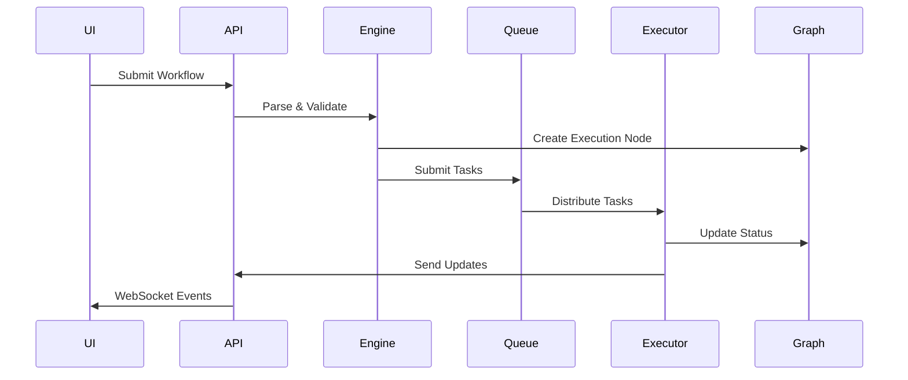

# TwinGraph Architecture

## Table of Contents
- [System Overview](#system-overview)
- [Core Components](#core-components)
- [Execution Flow](#execution-flow)
- [Data Flow](#data-flow)
- [Platform Integrations](#platform-integrations)
- [Security Architecture](#security-architecture)
- [Scalability Design](#scalability-design)
- [Technology Stack](#technology-stack)

## System Overview

TwinGraph implements a microservices architecture with clear separation between presentation, orchestration, and execution layers.

```
┌─────────────────────────────────────────────────────────────┐
│                        Web UI (React)                        │
│                   Visual Workflow Designer                   │
└──────────────────────┬──────────────┬──────────────────────┘
                       │              │
                   HTTP/REST      WebSocket
                       │              │
┌──────────────────────┴──────────────┴──────────────────────┐
│                    FastAPI Backend                          │
│              REST API + GraphQL + WebSocket                 │
└──────────────┬────────────────────────────┬────────────────┘
               │                            │
        Orchestration                   Monitoring
               │                            │
┌──────────────┴────────────┐  ┌───────────┴────────────────┐
│   Orchestration Engine    │  │    Graph Database          │
│   (Celery + Python Core)  │  │  (TinkerGraph/Neptune)     │
└──────────────┬────────────┘  └────────────────────────────┘
               │
    ┌──────────┴──────────┬──────────┬──────────┬──────────┐
    │                     │          │          │          │
┌───┴────┐  ┌────────┐  ┌─┴──┐  ┌───┴────┐  ┌─┴──────┐
│ Docker │  │   K8s  │  │Lambda│  │ Batch  │  │ Local  │
└────────┘  └────────┘  └─────┘  └────────┘  └────────┘
```

## Core Components

### 1. Web UI Layer

**Technology**: React 18 + TypeScript + Vite

**Components**:
- **Workflow Designer**: React Flow-based visual editor
- **Code Editor**: Monaco Editor for inline code editing
- **Graph Visualizer**: vis-network for execution visualization
- **Dashboard**: Workflow management and monitoring

**State Management**: Zustand for client state, React Query for server state

### 2. API Layer

**Technology**: FastAPI + Python 3.9+

**Endpoints**:
- **REST API**: CRUD operations for workflows, executions
- **GraphQL**: Complex queries for nested data
- **WebSocket**: Real-time execution updates

**Features**:
- OpenAPI documentation
- Request validation with Pydantic
- JWT authentication
- Rate limiting
- CORS handling

### 3. Orchestration Engine

**Core**: Python-based orchestration with pluggable executors

**Components**:
```python
# Simplified architecture
class OrchestrationEngine:
    def __init__(self):
        self.executor_registry = ExecutorRegistry()
        self.graph_manager = GraphManager()
        self.scheduler = Scheduler()
    
    def execute_workflow(self, workflow: Workflow):
        # Parse workflow
        dag = self.parse_workflow(workflow)
        
        # Create execution plan
        plan = self.scheduler.create_plan(dag)
        
        # Execute components
        for task in plan:
            executor = self.executor_registry.get(task.platform)
            result = executor.execute(task)
            self.graph_manager.record(task, result)
```

### 4. Execution Platforms

Each platform has a dedicated executor implementing the base interface:

```python
class PlatformExecutor(ABC):
    @abstractmethod
    def execute(self, component: Component, inputs: Dict) -> Dict:
        pass
    
    @abstractmethod
    def get_status(self, execution_id: str) -> Status:
        pass
```

**Implementations**:
- `LocalExecutor`: Direct Python execution
- `DockerExecutor`: Container-based isolation
- `KubernetesExecutor`: Pod creation and management
- `LambdaExecutor`: AWS Lambda invocation
- `BatchExecutor`: AWS Batch job submission

### 5. Graph Database

**Purpose**: Execution tracking and lineage

**Schema**:
```groovy
// Vertex types
vertex: Component {
    name: string
    execution_id: string
    hash: string
    status: enum
    platform: string
    started_at: datetime
    completed_at: datetime
    inputs: json
    outputs: json
}

vertex: Pipeline {
    name: string
    pipeline_id: string
    version: string
}

// Edge types
edge: DEPENDS_ON {
    data_flow: json
}

edge: BELONGS_TO {
    component_order: int
}
```

### 6. Message Queue

**Technology**: Redis (default) / RabbitMQ (alternative)

**Usage**:
- Task distribution for Celery workers
- Result backend for async operations
- Pub/sub for real-time updates

## Execution Flow

### 1. Workflow Submission



### 2. Component Execution

```python
# Component execution lifecycle
def execute_component(component, inputs):
    # 1. Pre-execution
    validate_inputs(component, inputs)
    execution_id = generate_execution_id()
    
    # 2. Platform selection
    executor = get_executor(component.platform)
    
    # 3. Environment preparation
    env = prepare_environment(component)
    
    # 4. Execution
    start_time = time.time()
    try:
        outputs = executor.run(component.code, inputs, env)
        status = "success"
    except Exception as e:
        outputs = None
        status = "failed"
        handle_error(e)
    
    # 5. Post-execution
    duration = time.time() - start_time
    record_execution(execution_id, status, outputs, duration)
    
    return outputs
```

### 3. Dependency Resolution

The engine uses topological sorting to determine execution order:

```python
def resolve_dependencies(workflow):
    graph = build_dependency_graph(workflow)
    
    # Topological sort
    sorted_components = []
    visited = set()
    
    def visit(node):
        if node in visited:
            return
        visited.add(node)
        for dep in graph.dependencies[node]:
            visit(dep)
        sorted_components.append(node)
    
    for component in workflow.components:
        visit(component)
    
    return sorted_components
```

## Data Flow

### 1. Input/Output Serialization

All data between components is serialized to JSON:

```python
class DataSerializer:
    @staticmethod
    def serialize(data: Any) -> str:
        if isinstance(data, NamedTuple):
            return json.dumps(data._asdict())
        elif hasattr(data, 'to_dict'):
            return json.dumps(data.to_dict())
        else:
            return json.dumps(data)
    
    @staticmethod
    def deserialize(data: str, type_hint: Type) -> Any:
        obj = json.loads(data)
        if hasattr(type_hint, '_fields'):
            return type_hint(**obj)
        return obj
```

### 2. Large Data Handling

For data exceeding serialization limits:

```python
class LargeDataHandler:
    def __init__(self, storage_backend):
        self.storage = storage_backend
    
    def handle_output(self, data, size_limit=5*1024*1024):
        serialized = serialize(data)
        if len(serialized) > size_limit:
            # Store in object storage
            key = f"outputs/{generate_id()}"
            self.storage.put(key, serialized)
            return {"type": "reference", "key": key}
        return {"type": "inline", "data": data}
```

### 3. Streaming Support

For continuous data flows:

```python
class StreamingComponent:
    def execute_streaming(self, input_stream):
        for chunk in input_stream:
            processed = self.process_chunk(chunk)
            yield processed
```

## Platform Integrations

### Docker Integration

```python
class DockerExecutor(PlatformExecutor):
    def __init__(self):
        self.client = docker.from_env()
    
    def execute(self, component, inputs):
        # Create container
        container = self.client.containers.run(
            image=component.docker_image,
            command=self.build_command(component, inputs),
            detach=True,
            mem_limit=component.config.get('memory', '2g'),
            cpu_period=100000,
            cpu_quota=int(component.config.get('cpu', 1) * 100000),
            volumes=self.prepare_volumes(component)
        )
        
        # Wait for completion
        result = container.wait()
        logs = container.logs()
        container.remove()
        
        return self.parse_output(logs)
```

### Kubernetes Integration

```python
class KubernetesExecutor(PlatformExecutor):
    def __init__(self):
        config.load_incluster_config()
        self.v1 = client.CoreV1Api()
        self.batch_v1 = client.BatchV1Api()
    
    def execute(self, component, inputs):
        # Create job
        job = self.create_job_manifest(component, inputs)
        self.batch_v1.create_namespaced_job(
            namespace=component.config.get('namespace', 'default'),
            body=job
        )
        
        # Monitor job
        return self.wait_for_completion(job.metadata.name)
```

### AWS Lambda Integration

```python
class LambdaExecutor(PlatformExecutor):
    def __init__(self):
        self.client = boto3.client('lambda')
    
    def execute(self, component, inputs):
        response = self.client.invoke(
            FunctionName=component.config['function_name'],
            InvocationType='RequestResponse',
            Payload=json.dumps({
                'component': component.to_dict(),
                'inputs': inputs
            })
        )
        
        return json.loads(response['Payload'].read())
```

## Security Architecture

### 1. Authentication & Authorization

```python
# JWT-based authentication
class AuthManager:
    def __init__(self, secret_key):
        self.secret_key = secret_key
    
    def create_token(self, user_id: str) -> str:
        payload = {
            'user_id': user_id,
            'exp': datetime.utcnow() + timedelta(hours=24)
        }
        return jwt.encode(payload, self.secret_key, algorithm='HS256')
    
    def verify_token(self, token: str) -> dict:
        try:
            return jwt.decode(token, self.secret_key, algorithms=['HS256'])
        except jwt.InvalidTokenError:
            raise AuthenticationError()
```

### 2. Secret Management

```python
class SecretManager:
    def __init__(self, backend='env'):
        self.backend = self._get_backend(backend)
    
    def get_secret(self, key: str) -> str:
        if self.backend == 'aws':
            return self._get_from_secrets_manager(key)
        elif self.backend == 'vault':
            return self._get_from_vault(key)
        else:
            return os.environ.get(key)
```

### 3. Network Security

- **TLS/SSL**: All external communications encrypted
- **VPC Isolation**: Cloud resources in private subnets
- **Security Groups**: Minimal required ports open
- **API Gateway**: Rate limiting and DDoS protection

## Scalability Design

### 1. Horizontal Scaling

**API Layer**: Multiple FastAPI instances behind load balancer
```nginx
upstream api_backend {
    server api1:8000;
    server api2:8000;
    server api3:8000;
}
```

**Worker Scaling**: Dynamic Celery worker allocation
```python
# Auto-scaling based on queue depth
def scale_workers():
    queue_depth = get_queue_depth()
    current_workers = get_worker_count()
    
    if queue_depth > threshold_high:
        scale_up(min(max_workers - current_workers, scale_factor))
    elif queue_depth < threshold_low:
        scale_down(max(current_workers - min_workers, scale_factor))
```

### 2. Caching Strategy

```python
class CacheManager:
    def __init__(self):
        self.redis = Redis()
        self.local_cache = LRUCache(maxsize=1000)
    
    def get_or_compute(self, key, compute_func, ttl=3600):
        # L1: Local cache
        if key in self.local_cache:
            return self.local_cache[key]
        
        # L2: Redis cache
        cached = self.redis.get(key)
        if cached:
            value = json.loads(cached)
            self.local_cache[key] = value
            return value
        
        # Compute and cache
        value = compute_func()
        self.redis.setex(key, ttl, json.dumps(value))
        self.local_cache[key] = value
        return value
```

### 3. Database Optimization

- **Read Replicas**: Separate read/write operations
- **Indexing**: Graph traversal optimization
- **Partitioning**: Time-based execution data partitioning
- **Connection Pooling**: Reuse database connections

## Technology Stack

### Backend
- **Language**: Python 3.9+
- **Framework**: FastAPI
- **Task Queue**: Celery 5.2+
- **Message Broker**: Redis 6+ / RabbitMQ
- **Graph Database**: Apache TinkerGraph / Amazon Neptune
- **ORM**: SQLAlchemy (for metadata)
- **Serialization**: Pydantic

### Frontend
- **Framework**: React 18
- **Language**: TypeScript
- **Build Tool**: Vite
- **State Management**: Zustand
- **UI Components**: Tailwind CSS + Headless UI
- **Graph Visualization**: React Flow + vis-network
- **Code Editor**: Monaco Editor

### Infrastructure
- **Container Runtime**: Docker 20.10+
- **Orchestration**: Kubernetes 1.24+
- **Service Mesh**: Istio (optional)
- **Monitoring**: Prometheus + Grafana
- **Logging**: ELK Stack
- **CI/CD**: GitHub Actions

### Cloud Services
- **AWS Lambda**: Serverless compute
- **AWS Batch**: Batch processing
- **Amazon S3**: Object storage
- **Amazon CloudWatch**: Logging
- **Amazon ECR**: Container registry

## Performance Considerations

### 1. Component Optimization
- Minimize serialization overhead
- Use streaming for large datasets
- Implement component-level caching

### 2. Network Optimization
- Batch API requests
- Use WebSocket for real-time updates
- Implement request deduplication

### 3. Resource Management
- Set appropriate resource limits
- Implement circuit breakers
- Use connection pooling

## Monitoring and Observability

### 1. Metrics Collection
```python
# Prometheus metrics
component_executions = Counter(
    'twingraph_component_executions_total',
    'Total component executions',
    ['component', 'platform', 'status']
)

execution_duration = Histogram(
    'twingraph_execution_duration_seconds',
    'Component execution duration',
    ['component', 'platform']
)
```

### 2. Distributed Tracing
```python
# OpenTelemetry integration
tracer = trace.get_tracer(__name__)

@tracer.start_as_current_span("execute_component")
def execute_component(component, inputs):
    span = trace.get_current_span()
    span.set_attribute("component.name", component.name)
    span.set_attribute("component.platform", component.platform)
    # ... execution logic
```

### 3. Health Checks
```python
@app.get("/health")
async def health_check():
    checks = {
        "api": "healthy",
        "database": check_database_connection(),
        "redis": check_redis_connection(),
        "graph": check_graph_connection()
    }
    
    status = "healthy" if all(
        v == "healthy" for v in checks.values()
    ) else "unhealthy"
    
    return {"status": status, "checks": checks}